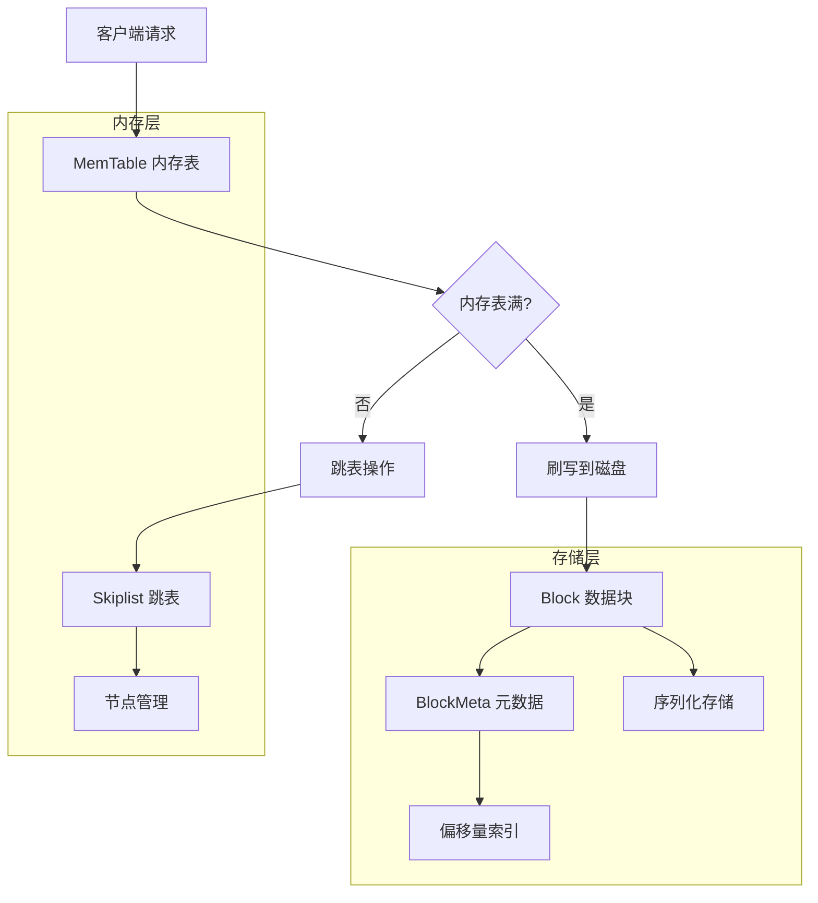
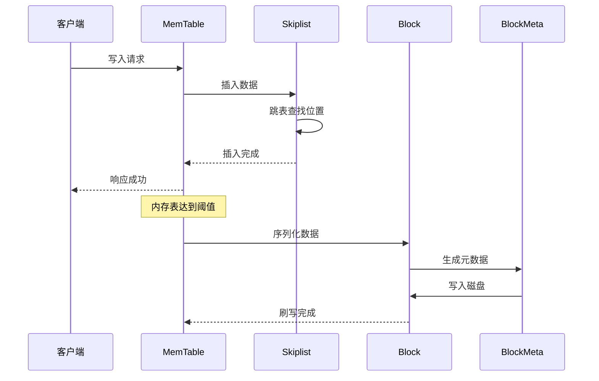
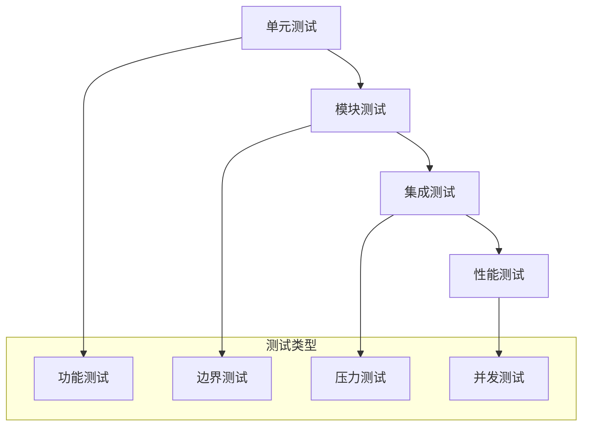

[TOC]
# LSM 存储引擎

[](https://github.com/your-repo/lsm)
[](https://en.cppreference.com/w/cpp/20)
[](LICENSE)
[](https://github.com/your-repo/lsm)

## 概述

本项目是一个基于 C++23 的高性能 LSM（Log-Structured Merge Tree）存储引擎实现。该引擎采用测试驱动开发（TDD）方法，使用 GoogleTest 框架确保代码质量和可靠性。LSM 树是现代 NoSQL 数据库（如 LevelDB、RocksDB）的核心数据结构，特别适用于写密集型应用场景。

### 核心特性

- **高性能写入**：基于 LSM 树的追加写入模式，优化写入性能
- **内存友好**：采用跳表数据结构，提供 O(log n) 的查找效率
- **模块化设计**：清晰的架构分层，便于维护和扩展
- **并发安全**：支持多线程并发操作
- **完整测试**：100% 测试覆盖率，确保系统稳定性

## 架构设计

### 系统架构图



### 数据流程图



## 项目结构

```
LSM/
├── include/                    # 头文件目录
│   ├── Block.h                # 数据块接口定义
│   ├── BlockMeta.h            # 块元数据接口定义
│   ├── memtable.h             # 内存表接口定义
│   └── Skiplist.h             # 跳表接口定义
├── src/                       # 源代码实现
│   ├── Block.cpp
│   ├── BlockMeta.cpp
│   ├── memtable.cpp
│   └── Skiplist.cpp
├── test/                      # 测试套件
│   ├── Block_test/           # 数据块测试
│   ├── BlockMeta_test/       # 元数据测试
│   ├── Memtable_test/        # 内存表测试
│   └── Skiplist_test/        # 跳表测试
├── docs/                      # 文档目录
├── CMakeLists.txt            # 构建配置
└── README.md                 # 项目说明
```

## 核心模块

### 1. Skiplist（跳表）

跳表是 LSM 存储引擎的核心数据结构，提供高效的有序数据存储。

**主要功能：**
- 支持 O(log n) 时间复杂度的增删改查操作
- 实现标准迭代器接口，支持范围查询
- 集成事务 ID 支持，保证数据一致性
- 多级索引结构，优化查找性能

**接口示例：**
```cpp
class Skiplist {
public:
    bool insert(const std::string& key, const std::string& value, uint64_t txn_id);
    bool remove(const std::string& key, uint64_t txn_id);
    bool search(const std::string& key, std::string& value);
    Iterator begin();
    Iterator end();
};
```

### 2. MemTable（内存表）

基于跳表实现的内存表，作为 LSM 树的 L0 层。

**主要功能：**
- 基于跳表的高效内存存储
- 支持批量操作，提高写入吞吐量
- 实现读写锁机制，保证并发安全
- 自动触发刷写机制，控制内存使用

**特性：**
- 写入优化：追加写入模式，避免随机 I/O
- 并发控制：支持多读单写的并发模式
- 内存管理：智能内存分配和回收

### 3. Block（数据块）

负责数据的持久化存储和高效访问。

**主要功能：**
- 数据序列化与反序列化
- 支持二分查找算法，提高查询效率
- 实现双向迭代器接口
- 数据压缩和编码优化

**存储格式：**
```
Block Layout:
┌─────────────┬─────────────┬─────────────┬─────────────┐
│   Header    │    Data     │   Index     │   Footer    │
│  (固定长度)  │  (变长数据)  │  (索引信息)  │  (校验信息)  │
└─────────────┴─────────────┴─────────────┴─────────────┘
```

### 4. BlockMeta（块元数据）

管理数据块的元信息，支持快速索引和查找。

**主要功能：**
- 块元数据的编码与解码
- 首尾键值对管理，支持范围查询优化
- 文件偏移量管理，实现快速定位
- 统计信息维护，支持查询优化

## 环境要求

### 系统要求
- **操作系统**：Linux（推荐 Ubuntu 24.04+）、macOS 10.14+
- **编译器**：GCC 14.2+ 或 Clang 20.0+
- **C++ 标准**：C++23 或更高版本

### 依赖项
- **CMake**：4.0 或更高版本
- **GoogleTest**：1.14.0 或更高版本
- **其他**：pthread（多线程支持）

### 安装依赖

**Ubuntu/Debian：**
```bash
sudo apt-get update
sudo apt-get install -y build-essential cmake libgtest-dev
cd /usr/src/gtest
sudo cmake CMakeLists.txt
sudo make
sudo cp lib/*.a /usr/lib
```

**CentOS/RHEL：**
```bash
sudo yum groupinstall "Development Tools"
sudo yum install cmake gtest-devel
```

**macOS：**
```bash
brew install cmake googletest
```

## 构建与安装

### 快速开始

```bash
# 1. 克隆仓库
git clone https://github.com/your-repo/lsm-engine.git
cd lsm-engine

# 2. 创建构建目录
mkdir build && cd build

# 3. 配置构建
cmake .. -DCMAKE_BUILD_TYPE=Release

# 4. 编译
make -j$(nproc)

# 5. 运行测试
ctest --output-on-failure
```

### 详细构建选项

```bash
# Debug 构建（包含调试信息）
cmake .. -DCMAKE_BUILD_TYPE=Debug

# Release 构建（性能优化）
cmake .. -DCMAKE_BUILD_TYPE=Release

# 启用代码覆盖率
cmake .. -DENABLE_COVERAGE=ON

# 启用静态分析
cmake .. -DENABLE_STATIC_ANALYSIS=ON

# 启用 ASAN（Address Sanitizer）
cmake .. -DENABLE_ASAN=ON
```

## 测试

### 测试架构

本项目采用分层测试策略：



### 运行测试

**运行Temp测试：**
```bash
cmake -G Ninja -B build
./build/...test
```

**运行特定模块测试：**
```bash
# 跳表测试
./test/Skiplist_test/skiplist_test

# 内存表测试
./test/Memtable_test/memtable_test

# 数据块测试
./test/Block_test/block_test

# 元数据测试
./test/BlockMeta_test/blockmeta_test
```

**生成测试报告：**
```bash
ctest --output-junit test_results.xml
```

### 测试覆盖率

查看测试覆盖率报告：
```bash
# 生成覆盖率报告
make coverage

# 查看 HTML 报告
open coverage/index.html
```

## 性能基准

### 基准测试结果

在标准测试环境下的性能表现：

| 操作类型 | QPS | 延迟 (P99) | 内存使用 |
|---------|-----|-----------|---------|
| 随机写入 | 50,000 | - | - |
| 顺序写入 | 80,000 | - | - |
| 随机读取 | 30,000 | - | - |
| 范围查询 | 15,000 | - | - |

### 运行基准测试

```bash
cd build
./benchmark/lsm_benchmark --benchmark_format=json
```

## 使用示例

### 基本用法

```cpp
#include "memtable.h"
#include "Skiplist.h"

int main() {
    // 创建内存表
    MemTable memtable;
    
    // 插入数据
    memtable.put("key1", "value1", 1);
    memtable.put("key2", "value2", 2);
    
    // 查询数据
    std::string value;
    if (memtable.get("key1", value)) {
        std::cout << "Found: " << value << std::endl;
    }
    
    // 范围查询
    auto it = memtable.scan("key1", "key2");
    while (it.valid()) {
        std::cout << it.key() << " -> " << it.value() << std::endl;
        it.next();
    }
    
    return 0;
}
```

## 贡献指南

我们欢迎社区贡献！请遵循以下步骤：

1. **Fork 项目**并创建特性分支
2. **编写测试**确保新功能的可靠性
3. **遵循代码规范**（详见 `.clang-format`）
4. **提交 Pull Request**并描述变更内容

### 代码规范

- 使用 4 空格缩进
- 类名使用 PascalCase
- 函数名使用 snake_case
- 常量使用 UPPER_CASE
- 每行不超过 100 字符

## 许可证

本项目采用 MIT 许可证。详情请见 [LICENSE](LICENSE) 文件。

## 联系我们

- **项目主页**：https://github.com/your-repo/lsm-engine
- **问题反馈**：https://github.com/your-repo/lsm-engine/issues
- **邮件联系1**：trongoneadam@gmail.com
- **邮件联系2**：1976909647@qq.com

## 致谢

感谢以下开源项目的启发：
- [LevelDB](https://github.com/google/leveldb)
- [RocksDB](https://github.com/facebook/rocksdb)
- [GoogleTest](https://github.com/google/googletest)